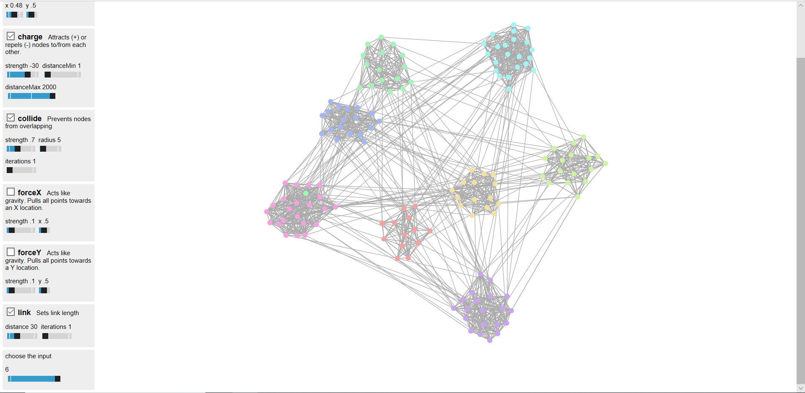

E6893 Big Data Analytics Final Project - 18 Fall (Project ID: 201812-1)

# Community-Detection-In-AML
Project name: Community Detection in Anti-Money Laundering(AML)  
Project ID: 201812-1  
Team Members: Anke Xu(ax2127),  Tianyao Hua(th2706),  Siyu Liu(sl4262)

## Project Summary
Money Laundering is the act of disguising and transferring the illegally obtained money. It is often related to organizational crimes and causes huge losses to government, related financial service companies, and society. Detecting the organized criminal groups is important for Anti-Money Laundering (AML) because it both enhances true positive rate in capturing all criminals and decreases the false positive rate in misclassifying innocents by limited transactions. We implemented and improved the CESNA method to identify and visualize the money laundering communities on our simulated datasets.

For the results, community detection technique would be a feasible strategy for detection the groups of people who may conduct money laundering for their illegal gains. The experiment results show that the algorithm is robust enough for predicting small or large number of nodes and it also works for sparse or dense connection communities. By examining the cross-entropy loss and error rate for both connection types, we claimed that the improved CESNA algorithm could identify group labels in the sparse and dense connection cases and improved robustness in the presence of noise in the network structure, neither the orginal CESNA algorithm nor other methods can achieve this. In addition, our algorithm could detect communities with dense connections more accurate since there are more information for the network structure. We have visualized the results on the simulated data as discussed in the previous section and proved that this is a possible solution for detecting money laundering groups. If given the real finance data, we expect this algorithm would help reduce false positive in the prediction. 

One more thing that we could develop in the future is increasing the speed of computation since the amount of data we used is limited by the efficiency of the algorithm. Some possible solutions would be adding parallel computation method into the algorithm or deploying the current algorithm onto the Spark or other big data platform tools.

## Data & Data Processing
Data is not uploaded to github due to size limitation. You can find the orginal dataset Paysim.csv on Kaggle (6,362,320 rows,about 500M).
[Synthetic Financial Datasets For Fraud Detection](https://www.kaggle.com/ntnu-testimon/paysim1)

Then we simulated the communities for data processing based on two methods. And the simulated datasets are over 500M. Methodologies for data simulation are described in the System Overview part in the final report. Codes for simulating data are here:  
[Dataset1](https://github.com/Sapphirine/Community-Detection-In-AML/data/Paysim_Simulating.ipynb)  
[Dataset2_GenerateData](https://github.com/Sapphirine/Community-Detection-In-AML/data/generate_data.py)  
[Dataset2_GenerateAttributes](https://github.com/Sapphirine/Community-Detection-In-AML/data/attributes.py)

## Visualization
We built a visualization tool for seeing the community detection results as network graphs, and its codes are under ./web_demo. 
We test our algorithm on 6 datasets, with different size and different group connection density. 
The more similar the colors are, the more likely that these nodes share a same community.

## Modeling
The CESNA algorithm code is under ./code folder. Because the origin CESNA algorithm doesn’t consider the degree of weights, that means it may not be able to distinguish communities if the network is too sparse, where all nodes have similar small degrees and look similar to each other. But with our improvement, the algorithm become more robust and did achieve differentiating communities in various cases.

You can find the improved CESNA algorithm in [CESNA.py](https://github.com/Sapphirine/Community-Detection-In-AML/code/CESNA.py). And how we generate simulated dataset for this demo and how we evaluate the algorithm can also be found in the same python script.

Algorithm Reference:
[Yang, J., McAuley, J.,  Leskovec, J. Community detection in networks with node attributes. IEEE 13th International Conference on Data Mining (icdm), 1151–1156. 2013.](https://github.com/Sapphirine/Community-Detection-In-AML/doc/cesna-icdm13.pdf).

## Presentation
[Proposal Presentation](https://github.com/Sapphirine/Community-Detection-In-AML/doc/BigData_Final_Project_Proposal.pdf).  
[Final Presentation](https://github.com/Sapphirine/Community-Detection-In-AML/doc/BigData_Final_Project.pdf).

## Youtube Video
[Proposal](https://www.youtube.com/watch?v=v8HZH7oLGQg)  
[Demo](https://www.youtube.com/watch?v=k0SItZ1MW-c)
